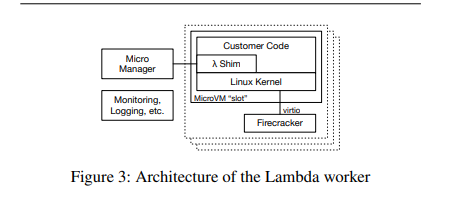

# Firecracker: Lightweight Virtualization for Serverless Applications

2025-04-23

[Firecracker](https://www.usenix.org/system/files/nsdi20-paper-agache.pdf) is
AWS' [open source](https://firecracker-microvm.github.io/) virtual machine
monitor used in it's serverless functions and container offerings (Lambda and
Fargate)

Firecracker is a good case study because of it's small(er) scope than many other
VMMs out there. It
[promises](https://github.com/firecracker-microvm/firecracker/blob/main/SPECIFICATION.md)
fast VM startup, minimal overhead and strong security among other things.

## The need for a new VMM

Serverless compute allows you to run workloads on rented computers without
worrying about managing them. This is a good business to be in as cloud
providers. Multi-tenancy (running multiple workloads on the same computer) is a
lucrative business model but poses challenges:

- Security - one workload should not be able to access data from another
- Performance - should not decrease due to resource sharing (noisy neighbour
  effect)

Operating system virtualization has been explored before. The linux kernel has
builtin mechanisms for this:

- `cgroups` - grouping process and managing resource usage
- `namespaces` - separate kernel resources like PIDs
- `seccomp-bpf` - controlling access to syscalls
- `chroot` - providing an isolated filesystem

This provides strong isolation but we are trading off security (due to workloads
sharing the same kernel) and code compatibility (customers should be able to run
arbitrary linux binaries)

Hypervisor based virtualiztion solves for the two issues but carries with it an
performance overhead.

Firecracker was built to have the best of both hypervisor virtualization and OS
level containers - you get performance and isolation together

## VMM

Firecracker VMM uses the KVM infrastructure built into linux kernel to provide
minimal virtual machines. It relies on components built into linux rather than
re-implementing their own. Eg: block I/O is passed through to the kernel,
TUN/TAP is used as virtual network interfaces.

### Device model

A minimal set of devices are emulated:

- serial ports
- partial PS/2 keyboard controller via i8042
- network and block devices: virtio (an open API standard) is used for exposing
  emulated devices. Storage only supports block devices and not filesystem as
  the implementation can be complex and also increases the security risks

### API

Firecracker exposes REST API as a means to specify guest kernel, boot arguments,
network configs, storage configs, guest machine configs and cpuid, logging,
metrics, rate limiters etc.

### Rate limiting and performance

The APIs can be used to describe the cores and memory required by the VMs as
well as set things like cpuids. Firecracker does not emulate missing CPU
functionality and cpuids are more used for hiding things from the VMs making the
fleet of heterogenous computers appear homogenous

Builtin rate limiting is applied to storage (IOPS) and networking (PPS). They
can also be configured via the REST APIs to change things on demand when needed.
The storage / networking components are rate limited to allow for control plane
operations and ensuring that a small numbers of VMs don't hijack these resources

### Jailer

An important additional security measure is wrapping the firecracker VMM around
a jailer process that sandboxes the VMM and:

- runs it in a _chroot_ environment
- isolating it in _pid_ and networking namespaces
- dropping privileges
- setting a restrictive _seccomp\_bpf_ profile - whitelisting some syscalls

## In AWS Lambda

Lambda provides _serverless functions_ which runs functions in response to
events in your code. Lambda functions run within a sandbox, which provides
minimal Linux userland and some libraries and utilities.

The execution of customer code happens inside the lambda worker fleet
(architecture shown above). Workers provide a _slot_ which provides pre-loaded
environments for executing functions.

Each worker can run hundreds or thousands of MicroVMs (each having one slot).
Along with a minimal linux userland and kernel each MicroVM contains a shim
process which communicates with the outside control plane. One firecracker
process is launched per MicroVM, responsible for creating and managing the
MicroVM and providing device emulation and handling VM exits.

The shim process communicates with the "Micro Manager" via TCP/IP. The
micro-manager is responsible for managing the firecracker process inside the
worker. The manager communicates with the rest of the lambda stack to provide
status updates, sending payload / error messages etc. Communication between the
micro-manager and firecracker add some overhead but keeps the system loosely
coupled. This communication protocol is an important boundary because it
separates the multi-tenant control plane from the single tenant / single
function MicroVM

The MicroVM also has processes for logging, monitoring and the like that send
updates to humans and automated systems

The micro-manager also does optimizations such as pre-booting VMs to keep the
lambda hot-path fast

## Evaluation

Firecracker set out with a couple of goals which it achieves:

- __Isolation__: multiple workloads can run on the same hardware through
  virtualization
- __Overhead and density__: overhead is as low as 3% for memory and minimal for CPU
- __Performance__: block IO and network performance can be improved but are
  sufficient for Lambda and Fargate
- __Compatibility__: firecracker can run unmodified linux kernel and userland
- __Fast switching__: boot times are as low as 150ms, so switching is fast
- __Soft allocation__: memory and cpu are oversubscribed by multiple orders of
  magnitude

For some of the comparisons between Firecracker and other VMMs on metrics like
boot times, overhead and IO performance check out the firecracker paper

